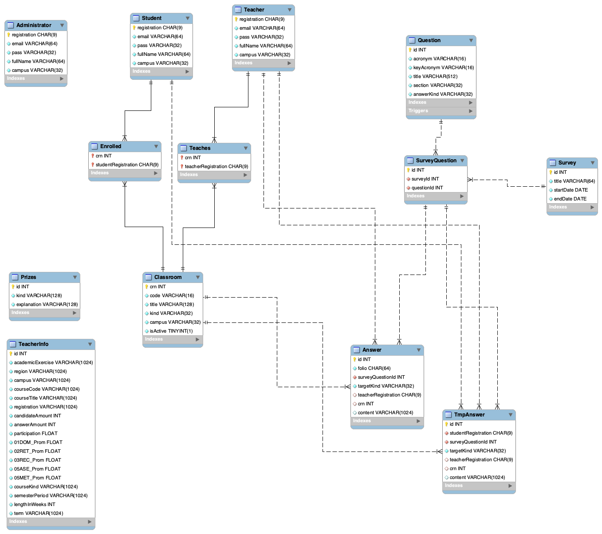

<p align="center">
    
</p>

<h2 align="center"> 
    A major redesign of the traditional Tec's primary satisfaction survey: ECOA
<h2>

<p align="center">
    <a href="https://github.com/prettier/prettier">
        
    </a>
</p>


# 📚 Usage

First, `mysql` is required.

For installing on Mac, run

```console
brew install mysql
```

For installing on Windows, check: https://dev.mysql.com/doc/refman/8.0/en/windows-installation.html

Then create a database named `ecoa`:

```sql
CREATE DATABASE ecoa;
```

After that, you must add a `.env` file at the root of the repo with your database configuration. For example:

```
DB_HOST="127.0.0.1"
DB_USER="root"
DB_NAME="ecoa"
```

> Note: if you've set a password, then add `DB_PASSWORD="<your password>"`

Make sure you have `node` and `npm` in your machine

In order to reset and seed the database with data you should use:

```console
npm run db:reset
```

Then for being able to start the server:

```console
npm start
```

Now if you open http://localhost:8080, it should be working

# 📑 Documents

- 📦 [Google Drive Folder](https://drive.google.com/drive/folders/18pnYM_UuBCcxaX-H8bqIiA9n4d28qxLd?usp=sharing)
- 📷 [Final Presentation Slides](https://drive.google.com/file/d/14o_AVzkfNEDO347Sl9mUJQ7ily8cvVNC/view?usp=share_link)

- 📦 [Google Drive Folder (Internal-Only)](https://drive.google.com/drive/folders/1D2RHVyTfaO_m26Hka9A1EXCZ5MDTx3B7?usp=sharing)
- 📌 [Rubric (Internal-Only)](https://docs.google.com/spreadsheets/d/1_pA1fRWtzcggmU9Bw4S-WutvSK5uTGxi/edit?usp=share_link&ouid=112199480319751895298&rtpof=true&sd=true)

# 💿 SQL Diagram



# Development Team

Team **2**

- **Backend** - Pedro Alonso Moreno Salcedo A01741437
- **Backend** - Kerim Taray Malagon A0027581
- **Unity** - Santiago Velasquez Chang A00832788
- **Unity** - Felipe de Jesús González Acosta A01275536
- **Frontend** - Adrián Alejandro Ramírez Cruz A00830640


# References & Credits

- Chris Kolmenic MySQL ENUM's Article: https://komlenic.com/244/8-reasons-why-mysqls-enum-data-type-is-evil/
- Table Inheritance Article: https://www.freecodecamp.org/news/single-table-inheritance-vs-polymorphic-associations-in-rails-af3a07a204f2/amp/
- Class Table Ineritance: https://www.martinfowler.com/eaaCatalog/classTableInheritance.html
- Single Table Ineritance: https://www.martinfowler.com/eaaCatalog/singleTableInheritance.html
- Inheritance vs Composition Article: https://betterprogramming.pub/inheritance-vs-composition-2fa0cdd2f939
- Dependency Injection Article: https://8r14z.medium.com/dependency-injection-for-dummies-168dad181a3d
- MiduDev: https://www.youtube.com/@midudev
- W3Schools: https://www.w3schools.com/
- StackExchange: https://stackexchange.com/
- StackOverflow: https://stackoverflow.com/
- MySQLTutorial: https://www.mysqltutorial.org/

```

```
