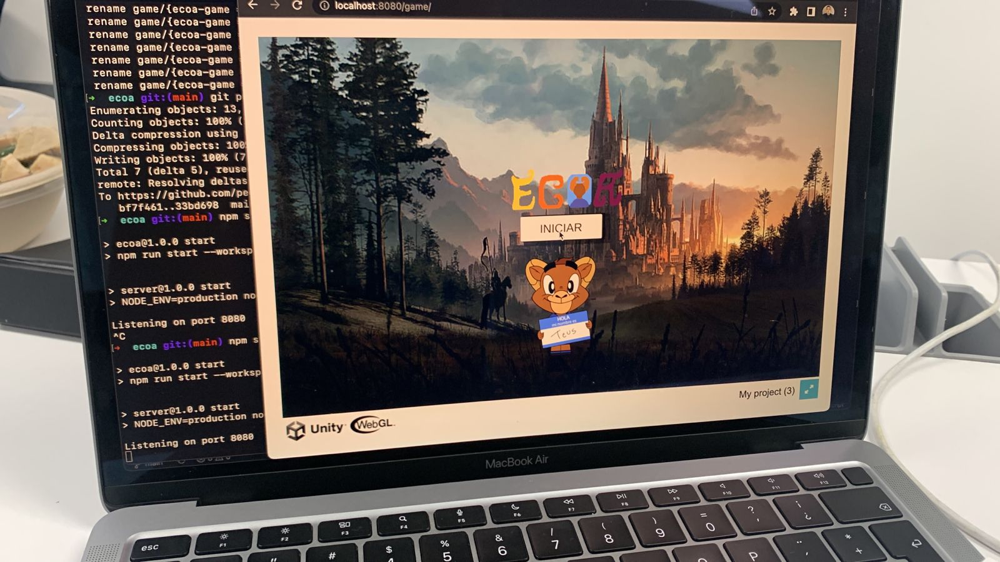

# ECOA

A major redesign of the traditional Tec's primary satisfaction survey: ECOA

# ToDo's - Domingo

## Videojuego

- [ ] Animación Teus feliz/triste
- [ ] Animación Espada ✅
- [ ] Animación Premio Random
- [ ] Fondos con PixelArt
- [ ] Referencias de las imagenes
- [ ] Hacer los fetch para las preguntas, profesores y materias
- [ ] Hacer el fetch para el premio final
- [ ] Sharp pixel-art on `Unity`, preguntar a Immanol.
- [ ] Botón para hacer `skip` de la pregunta.
- [ ] Implementar sprites del profe
- [ ] Música de fondo
- [ ] Sonido de click al botón
- [ ] Arreglar el botón de `back`
- [ ] Cambiar materia a `unidad de formación`
- [ ] Cuando el usuario le de a finalizar, debe haber un fetch que probablemente retorne un error si intenta finalizarla pero le faltan preguntas. Eso se debe mostrar en una alerta en el videojuego.

## Front

- [ ] Color de UI similar al del videojuego
- [ ] Terminar sección de Encuestas
- [ ] Mejorar diseño de CSS
- [ ] Re-diseñar front de encuesta activa, ahora será por medio de fechas
- [ ] Añadir sección para `Bloque`
- [ ] Cachar error cuando pones título duplicado en el survey (viene del back)
- [ ] Cachar error cuando quieres crear una encuesta que es en una fecha con overlap (viene del back)
- [ ] Cachar error cuando la startDate es mayor que la endDate (viene del back)
- [ ] Dashboard de PowerBI

## Backend

- [ ] Endpoints faltantes de `answers`, `comments`, `finish`
- [ ] Respuestas del 0 - 10 y el NULL value. Agregar validación `zod`.
- [ ] Poner RUBRICA 2 stores procedures y 1 trigger (aunque no se ocupen)
- [ ] Poder reordenar preguntas de la Ecoa? Si, mantener orden
- [ ] Implementar feature de `activa` internamente para simular periodos
- [ ] Acomodar bien el diagrama relacional del workbench
- [ ] Preguntar si los 2 stored procedures y 1 trigger que re-hicimos están bien
- [ ] Dashboard de PowerBI para vista de /profesor?
- [ ] Cuando el usuario le de a finalizar, debe haber un error si intenta finalizarla pero le faltan preguntas.
- [ ] Pasa algo si agregamos el string: `¿Cómo evalúas los siguientes enunciados relacionados con el Bloque?  Los temas, las actividades y el reto durante el Bloque:` antes de cada pregunta?

# References & Credits

- Chris Kolmenic MySQL ENUM's Article: https://komlenic.com/244/8-reasons-why-mysqls-enum-data-type-is-evil/
- Table Inheritance Article: https://www.freecodecamp.org/news/single-table-inheritance-vs-polymorphic-associations-in-rails-af3a07a204f2/amp/
- Class Table Ineritance: https://www.martinfowler.com/eaaCatalog/classTableInheritance.html
- Single Table Ineritance: https://www.martinfowler.com/eaaCatalog/singleTableInheritance.html
- Inheritance vs Composition Article: https://betterprogramming.pub/inheritance-vs-composition-2fa0cdd2f939
- Dependency Injection Article: https://8r14z.medium.com/dependency-injection-for-dummies-168dad181a3d
- MiduDev: https://www.youtube.com/@midudev
- W3Schools: https://www.w3schools.com/
- StackExchange: https://stackexchange.com/
- StackOverflow: https://stackoverflow.com/
- MySQLTutorial: https://www.mysqltutorial.org/

# Development Team

Team **2**

- **Backend** - Pedro Alonso Moreno Salcedo A01741437
- **Backend** - Kerim Taray Malagon A0027581
- **Unity** - Santiago Velasquez Chang A00832788
- **Unity** - Felipe de Jesús González Acosta A01275536
- **Frontend** - Adrián Alejandro Ramírez Cruz A00830640

